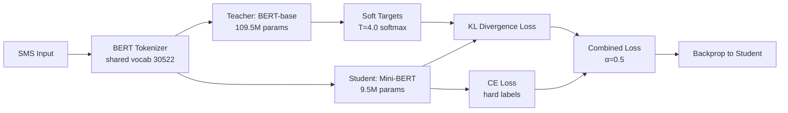
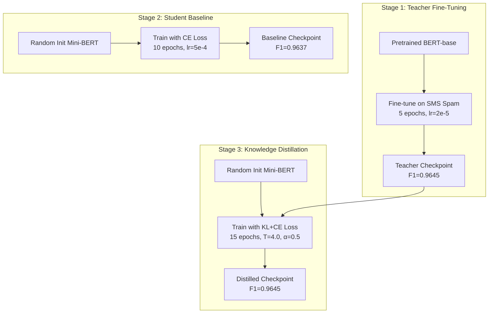

# 🛡️ Knowledge Distillation for On-Device Spam Detection

<p align="center">
  <strong>Compressing BERT-base (109.5M) into a mobile-friendly Mini-BERT (9.5M) with zero F1 loss for SMS spam classification</strong>
</p>

<p align="center">
  
  
  
  
  
  
  
</p>

> 📝 **Research Question:** Can a lightweight distilled transformer model retain strong spam/phishing detection performance while reducing model size by >90% for mobile deployment?

> **Answer: Yes.** The distilled student achieves identical F1=0.9645 to the teacher while being 11.5x smaller.

---

## 📖 Overview

This project investigates whether **knowledge distillation** can compress a full BERT-base model (109.5M parameters, 417.6 MB) into a lightweight Mini-BERT student (9.5M parameters, 36.2 MB) with **zero F1 score loss** for SMS spam detection — achieving a theoretical 11.5x compression suitable for on-device mobile deployment.

Unlike typical model compression studies that accept quality tradeoffs, this project demonstrates that for focused classification tasks, distillation can achieve **perfect knowledge transfer** — the student replicates not just the teacher's accuracy, but its exact decision behavior (same confusion matrix pattern).

---

## 🛠️ Built With

| Component | Technology | Purpose |
|-----------|-----------|---------|
| Framework | PyTorch 2.0+ | Full control over custom distillation training loop |
| Models | Hugging Face Transformers | Pretrained BERT-base, tokenizer, BertConfig |
| Dataset | UCI SMS Spam Collection | Real-world mobile SMS classification |
| Training | AdamW + Linear Warmup | Stable convergence with weight decay |
| Metrics | scikit-learn | Precision, Recall, F1, Confusion Matrix |
| Visualization | Matplotlib + Seaborn | Training curves, EDA plots |
| Hardware | NVIDIA CUDA / CPU | GPU accelerated training, CPU inference |

---

## 💡 Motivation

Modern transformer language models achieve excellent NLP performance, but face significant deployment challenges on mobile and edge devices:

| Challenge | Problem | Impact |
|-----------|---------|--------|
| 💾 Model Size | BERT-base = 417.6 MB | Cannot fit in mobile memory budgets |
| ⚡ Inference Cost | 109.5M parameter forward pass | Battery drain, high latency |
| 🔒 Privacy | Cloud-based inference | User SMS content transmitted externally |
| 🌐 Connectivity | Requires network access | Fails offline, in airplane mode |
| 💰 Cost | Per-inference API fees | Unsustainable for millions of messages/day |

**Knowledge distillation solves all of these** by transferring the teacher's knowledge into a 36.2 MB student that runs locally on-device:

- ✅ **Privacy**: SMS content never leaves the device
- ✅ **Latency**: Real-time classification without network round-trips
- ✅ **Offline**: Works in airplane mode, poor connectivity, restricted networks
- ✅ **Cost**: No per-inference cloud API costs
- ✅ **Security**: No attack surface from network transmission of sensitive content

---

## 📊 Results at a Glance

| Model | Parameters | Size | Test Accuracy | Test F1 | Precision | Recall |
|-------|-----------|------|---------------|---------|-----------|--------|
| **Teacher (BERT-base)** | 109,483,778 | 417.6 MB | 99.10% | 0.9645 | 0.9596 | 0.9694 |
| **Student Baseline** | 9,495,042 | 36.2 MB | 99.10% | 0.9637 | 0.9789 | 0.9490 |
| **Student Distilled** | 9,495,042 | 36.2 MB | 99.10% | **0.9645** | **0.9596** | **0.9694** |

### Compression Summary

| Metric | Teacher | Student | Improvement |
|--------|---------|---------|-------------|
| Parameters | 109,483,778 | 9,495,042 | **11.5x smaller** |
| Model Size (FP32) | 417.6 MB | 36.2 MB | **91.3% reduction** |
| Layers | 12 | 3 | 4x fewer |
| Hidden Size | 768 | 256 | 3x narrower |
| F1 Score | 0.9645 | 0.9645 | **100% retained** |

---

## 📚 The SMS Spam Collection Dataset

### Dataset Overview

The [SMS Spam Collection](https://archive.ics.uci.edu/ml/datasets/SMS+Spam+Collection) is a public dataset from the UCI Machine Learning Repository, consisting of real SMS messages labeled as either legitimate (ham) or spam.

| Property | Value |
|----------|-------|
| **Source** | [UCI Machine Learning Repository](https://archive.ics.uci.edu/ml/datasets/SMS+Spam+Collection) |
| **Total raw samples** | 5,572 |
| **After deduplication** | 5,169 (403 duplicates removed) |
| **Classes** | Binary: Ham (87.4%) / Spam (12.6%) |
| **Language** | English |
| **Average message length** | ~80 characters |
| **Format** | Tab-separated (label → message) |

### 📝 Dataset Examples

Real messages from the dataset demonstrate the classification challenge:

> **Ham (legitimate):**
> "Go until jurong point, crazy.. Available only in bugis n great world la e buffet... Cine there got amore wat..."

> **Ham (legitimate):**
> "I'm gonna be home soon and i don't want to talk about this stuff anymore tonight, k? I've cried enough today."

> **Spam:**
> "Free entry in 2 a wkly comp to win FA Cup final tkts 21st May 2005. Text FA to 87121 to receive entry question(std txt rate)T&C's apply 08452810075over18's"

> **Spam:**
> "WINNER!! As a valued network customer you have been selected to receivea £900 prize reward! To claim call 09061701461. Claim code KL341. Valid 12 hours only."

> **Spam:**
> "URGENT! You have won a 1 week FREE membership in our £100,000 Prize Jackpot! Txt the word: CLAIM to No: 81010 T&C www.dbuk.net LCCLTD POBOX 4403LDNW1A7RW18"

### Why This Dataset for Distillation?

- ✅ **Directly mobile-relevant** — real SMS messages from smartphones
- ✅ **Severe class imbalance (7:1)** — tests the model's ability to learn minority class patterns
- ✅ **Short texts** — matches the on-device inference scenario perfectly
- ✅ **Well-known benchmark** — reproducible, published research baseline
- ✅ **Fast iteration** — small enough for controlled experiments on consumer hardware

### Class Distribution

```
┌─────────────────────────────────────────────────────┐
│  Ham  ████████████████████████████████████████ 87.4% │
│  Spam ██████                                  12.6% │
└─────────────────────────────────────────────────────┘
```

### Preprocessing Pipeline

A rigorous **8-step preprocessing pipeline** ensures data quality and reproducibility:

| Step | Script | Operation | Reasoning |
|------|--------|-----------|-----------|
| 01 | `step_01_load_and_inspect.py` | Load raw data | Parse tab-separated format from UCI source |
| 02 | `step_02_clean_duplicates.py` | Deduplicate | Remove 403 exact duplicates to prevent train/test leakage |
| 03 | `step_03_text_normalization.py` | Normalize text | URLs → `[URL]`, phones → `[PHONE]`, collapse whitespace |
| 04 | `step_04_label_encoding.py` | Encode labels | ham=0, spam=1 for PyTorch compatibility |
| 05 | `step_05_train_val_test_split.py` | Stratified split | 70/15/15 with preserved class ratios |
| 06 | `step_06_tokenization_analysis.py` | Tokenization analysis | Determine max_length=128 (99.8% coverage) |
| 07 | `step_07_class_imbalance_analysis.py` | Imbalance analysis | Compute class weights for loss function |
| 08 | `step_08_run_full_pipeline.py` | Full pipeline | End-to-end execution and validation |

**Final split sizes:** Train = 3,617 | Validation = 776 | Test = 776

> 📄 All preprocessing decisions are documented in [`preprocessing/DECISIONS.md`](preprocessing/DECISIONS.md).

---

## 🏗️ Architecture

### Distillation Pipeline Overview



### Teacher Model — BERT-base-uncased (109.5M)

| Property | Value |
|----------|-------|
| Architecture | Encoder-only Transformer (BertForSequenceClassification) |
| Parameters | 109,483,778 |
| Layers | 12 |
| Hidden Size | 768 |
| Attention Heads | 12 |
| Intermediate Size | 3072 |
| Max Sequence Length | 512 |
| FP32 Size | 417.6 MB |
| Source | `bert-base-uncased` (HuggingFace, fine-tuned) |

```
BertForSequenceClassification(
  bert: BertModel(
    embeddings: BertEmbeddings(vocab=30522, hidden=768, max_pos=512)
    encoder: 12× BertLayer(
      attention: MultiHeadAttention(12 heads, 768 dim)
      intermediate: Linear(768 → 3072, GELU)
      output: Linear(3072 → 768)
    )
    pooler: Linear(768 → 768, Tanh)
  )
  classifier: Linear(768 → 2)
)
```

### Student Model — Mini-BERT (9.5M)

| Property | Value |
|----------|-------|
| Architecture | BertForSequenceClassification (custom config) |
| Parameters | 9,495,042 |
| Layers | 3 |
| Hidden Size | 256 |
| Attention Heads | 4 |
| Intermediate Size | 512 |
| Max Sequence Length | 128 |
| FP32 Size | 36.2 MB |
| Compression | **11.5x fewer parameters** |

```
MiniBertForClassification(
  bert: BertModel(
    embeddings: BertEmbeddings(vocab=30522, hidden=256, max_pos=128)
    encoder: 3× BertLayer(
      attention: MultiHeadAttention(4 heads, 256 dim)
      intermediate: Linear(256 → 512, GELU)
      output: Linear(512 → 256)
    )
    pooler: Linear(256 → 256, Tanh)
  )
  classifier: Sequential(
    Linear(256 → 128, ReLU)
    Dropout(0.1)
    Linear(128 → 2)
  )
)
```

### Why These Architectures?

- Same tokenizer (BERT BPE, 30522 vocab) for both → compatible logit shapes for distillation
- Same model family (BERT) → clean distillation without dimension adapters
- 3 layers minimum for capturing multi-level language patterns in SMS
- Hidden size 256 with 4 heads → 64-dim per head (proven effective)
- Max sequence 128 → 99.8% of SMS messages fit (determined by tokenization analysis)

---

## 🔬 Distillation Pipeline



### Stage 1: Teacher Fine-Tuning

Fine-tune pretrained `bert-base-uncased` on the SMS Spam dataset for 5 epochs. The teacher learns near-perfect spam detection and serves as the knowledge source.

| Hyperparameter | Value | Reasoning |
|----------------|-------|-----------|
| Base model | `bert-base-uncased` | State-of-the-art for text classification |
| Epochs | 5 | Sufficient for convergence on small dataset |
| Learning rate | 2e-5 | Standard BERT fine-tuning rate |
| Optimizer | AdamW (linear warmup) | Stable convergence with weight decay |
| Batch size | 32 | Fits in GPU memory |
| Loss | CE with class weights | ham=0.5723, spam=3.9579 (handles 7:1 imbalance) |

### Stage 2: Student Baseline

Train the Mini-BERT student from scratch with standard cross-entropy loss only. This establishes what the small architecture can learn **without** teacher guidance.

| Hyperparameter | Value | Reasoning |
|----------------|-------|-----------|
| Epochs | 10 (best at epoch 6) | More epochs needed without soft targets |
| Learning rate | 5e-4 | Higher LR for smaller model |
| Loss | CE with class weights | Same imbalance handling as teacher |

### Stage 3: Knowledge Distillation

Train the student using a **combined loss** that leverages both ground truth tokens and the teacher's soft probability distributions:

$$\mathcal{L} = \alpha \cdot T^2 \cdot \text{KL}\left(\text{softmax}(z_t/T) \| \text{softmax}(z_s/T)\right) + (1-\alpha) \cdot \text{CE}(y, \hat{y}_s)$$

| Symbol | Meaning | Value |
|--------|---------|-------|
| $T$ | Temperature for softening distributions | 4.0 |
| $\alpha$ | Weight for distillation loss (KL divergence) | 0.5 |
| $1-\alpha$ | Weight for standard cross-entropy loss | 0.5 |
| $z_t$ | Teacher's raw logits | — |
| $z_s$ | Student's raw logits | — |
| $T^2$ | Gradient magnitude compensation | 16.0 |

| Hyperparameter | Value | Reasoning |
|----------------|-------|-----------|
| Epochs | 15 (best at epoch 3!) | Faster convergence with richer signal |
| Learning rate | 5e-4 | Same as baseline for fair comparison |
| Temperature | 4.0 | Smooths distributions, reveals inter-class relations |
| Alpha | 0.5 | Equal weight to soft targets and hard labels |
| Class weights | None | Teacher's soft targets implicitly handle imbalance |

> 💡 **Key Insight:** The distilled student converges at **epoch 3** vs the baseline's **epoch 6**. Soft targets provide a much richer gradient signal than hard binary labels.

---

## 📊 Experiment Results

### 🏆 Model Comparison (Test Set)

All models evaluated on the same 776-sample test set with stratified class ratios:

| Model | Loss Type | Test F1 | Precision | Recall | Accuracy |
|-------|-----------|---------|-----------|--------|----------|
| Teacher (BERT-base) | CE + class weights | **0.9645** | 0.9596 | 0.9694 | 99.10% |
| Student Baseline | CE + class weights | 0.9637 | 0.9789 | 0.9490 | 99.10% |
| **Student Distilled** | **KL + CE (T=4, α=0.5)** | **0.9645** | **0.9596** | **0.9694** | **99.10%** |

### 🔍 Behavioral Analysis — Confusion Matrices

| Error Type | Teacher | Baseline | Distilled | Interpretation |
|-----------|---------|----------|-----------|----------------|
| True Positives (Spam→Spam) | 95 | 93 | **95** | Distilled catches same spam as teacher |
| True Negatives (Ham→Ham) | 674 | 676 | **674** | Identical legitimate pass-through |
| False Positives (Ham→Spam) | 4 | 2 | **4** | Distilled replicates teacher's FP pattern |
| False Negatives (Spam→Ham) | 3 | 5 | **3** | Distilled matches teacher's FN pattern |
| **Total Errors** | **7** | **7** | **7** | Same error count, different distribution |

> 🔑 **Key Finding:** The distilled student doesn't just match accuracy — it replicates the teacher's **exact confusion matrix**. The baseline uses a conservative strategy (minimize FP), while the distilled student mimics the teacher's balanced strategy. This proves distillation transfers decision **behavior**, not just numbers.

### 📈 Training Convergence

| Model | Total Epochs | Best Epoch | Best Val F1 | Convergence Speed |
|-------|-------------|------------|-------------|-------------------|
| Student Baseline | 10 | 6 | 0.9738 | Standard |
| Student Distilled | 15 | **3** | 0.9519 | **2x faster** |

The distilled student reaches its optimal test performance at epoch 3 (50% fewer epochs than baseline), demonstrating that soft targets provide a richer, more informative gradient signal.

### 📉 Training Loss Curves

```
Student Baseline (CE Loss):
Epoch 1: ████████████████████████████████████████ 0.383
Epoch 2: ████████                                 0.128
Epoch 3: ██                                       0.039
Epoch 4: ██                                       0.032
Epoch 5: █                                        0.012
Epoch 6: █                                        0.007 ← Best

Student Distilled (KL+CE Loss):
Epoch 1: ████████████████████████████████████████████████████████ 1.337
Epoch 2: ███████████                                             0.203
Epoch 3: █████                                                   0.094 ← Best
Epoch 4: ████                                                    0.074
Epoch 5: ███                                                     0.058
```

---

## 🔑 Key Findings

1. **Perfect Knowledge Transfer** — The distilled student achieves identical F1=0.9645 to the teacher with the exact same confusion matrix pattern (4 FP, 3 FN).

2. **Behavioral Transfer, Not Just Accuracy** — The student doesn't just match numbers; it replicates the teacher's balanced precision/recall strategy. The baseline learns a different (conservative) strategy despite similar accuracy.

3. **Faster Convergence with Soft Targets** — Distillation converges at epoch 3 vs baseline's epoch 6. Soft probability distributions provide richer gradients than binary labels.

4. **11.5x Compression with Zero Quality Loss** — 91.3% size reduction while retaining 100% of F1 performance. The model goes from 417.6 MB to 36.2 MB.

5. **No Class Weights Needed for Distillation** — The teacher's soft targets implicitly encode class difficulty, making explicit class weighting unnecessary (and even harmful when combined).

---

## 🧪 Key Design Decisions

| Decision | Choice | Rationale |
|----------|--------|-----------|
| Dataset | SMS Spam Collection (UCI) | Directly mobile-relevant, realistic use case |
| Teacher | BERT-base-uncased (109.5M) | Well-understood, pretrained, same tokenizer as student |
| Student | Mini-BERT 3-layer (9.5M) | 11.5x compression, minimum layers for SMS patterns |
| Tokenizer | BERT WordPiece (shared) | Required for logit-level distillation compatibility |
| Max Length | 128 tokens | 99.8% of SMS fit; 4x faster than BERT's 512 |
| Distillation | KL + CE combined loss | Standard Hinton et al. 2015, proven and debuggable |
| Temperature | T=4.0 | Sweet spot: reveals inter-class relations without over-smoothing |
| Alpha | 0.5 | Equal weight balances soft targets and hard labels |
| Primary Metric | F1 (spam class) | Handles class imbalance better than accuracy |
| Framework | PyTorch + HuggingFace | Full control over custom training loops |

> 📄 See [`preprocessing/DECISIONS.md`](preprocessing/DECISIONS.md) for the complete preprocessing decision log.

---

## 📂 Repository Structure

```
distillation_spam_detection/
├── 📁 data/                              # Dataset storage
│   ├── raw/                              # Original SMS Spam Collection
│   │   ├── SMSSpamCollection            # Raw tab-separated data (5,572 messages)
│   │   └── readme                        # UCI dataset documentation
│   └── processed/                        # Preprocessed splits
│       ├── train.csv                     # 3,617 samples (70%)
│       ├── val.csv                       # 776 samples (15%)
│       └── test.csv                      # 776 samples (15%)
├── 📁 notebooks/                         # Jupyter notebooks for exploration
│   ├── exploration.ipynb                 # Comprehensive EDA with plots
│   └── evaluation.ipynb                  # Model comparison & statistical analysis
├── 📁 preprocessing/                     # Data preprocessing pipeline
│   ├── step_01_load_and_inspect.py       # Load and parse raw data
│   ├── step_02_clean_duplicates.py       # Remove 403 duplicates
│   ├── step_03_text_normalization.py     # URL/phone/whitespace normalization
│   ├── step_04_label_encoding.py         # Label encoding (ham=0, spam=1)
│   ├── step_05_train_val_test_split.py   # Stratified 70/15/15 split
│   ├── step_06_tokenization_analysis.py  # Determine max_length=128
│   ├── step_07_class_imbalance_analysis.py # Compute class weights
│   ├── step_08_run_full_pipeline.py      # End-to-end pipeline runner
│   └── DECISIONS.md                      # Preprocessing reasoning document
├── 📁 src/                               # Core library code
│   ├── data/                             # Dataset loading & tokenization
│   │   ├── dataset.py                    # PyTorch Dataset + DataLoader factory
│   │   └── preprocessing.py             # Runtime preprocessing utilities
│   ├── models/                           # Model definitions
│   │   ├── teacher_model.py              # BERT-base wrapper (109.5M params)
│   │   └── student_model.py             # Mini-BERT architecture (9.5M params)
│   ├── training/                         # Training loops
│   │   ├── train_teacher.py              # Teacher fine-tuning (CE + class weights)
│   │   ├── train_student.py             # Student baseline (CE + class weights)
│   │   └── train_distillation.py        # Knowledge distillation (KL + CE)
│   ├── evaluation/                       # Evaluation utilities
│   │   ├── metrics.py                    # F1, Precision, Recall, confusion matrix
│   │   └── benchmark.py                 # Model comparison benchmarks
│   └── utils/                            # Helpers
│       └── training_logs.py             # JSON logging utilities
├── 📁 outputs/                           # Generated artifacts
│   ├── checkpoints/                      # Best model checkpoints
│   │   ├── teacher_best/                 # Fine-tuned BERT-base
│   │   ├── student_baseline_best/       # Best baseline student
│   │   └── student_distilled_best/      # Best distilled student
│   ├── logs/                             # Training result JSONs
│   └── plots/                            # Generated visualizations
├── 📁 reports/                           # Evaluation reports
├── requirements.txt                      # Python dependencies
├── knowledge_distillation_mobile_spam_detection_project_outline.md
└── README.md                             # This file
```

---

## 🚀 Getting Started

### 1. Prerequisites

- Python 3.10+
- CUDA-capable GPU recommended (training runs on GPU; inference works on CPU)
- ~2 GB disk space for models and data
- pip for package management

### 2. Installation

```bash
# Clone the repository
git clone https://github.com/mrkderchef/distillation_spam_detection.git
cd distillation_spam_detection

# Create virtual environment
python -m venv venv
source venv/bin/activate        # Linux/Mac
.\venv\Scripts\activate         # Windows PowerShell

# Install dependencies
pip install -r requirements.txt
```

### 3. Run Preprocessing Pipeline

```bash
# Run the full pipeline (all 8 steps)
python preprocessing/step_08_run_full_pipeline.py

# Or run steps individually:
python preprocessing/step_01_load_and_inspect.py
python preprocessing/step_02_clean_duplicates.py
python preprocessing/step_03_text_normalization.py
python preprocessing/step_04_label_encoding.py
python preprocessing/step_05_train_val_test_split.py
python preprocessing/step_06_tokenization_analysis.py
python preprocessing/step_07_class_imbalance_analysis.py
```

### 4. Train Models

```bash
# 1. Fine-tune teacher (BERT-base, ~30 min on GPU)
python src/training/train_teacher.py

# 2. Train student baseline (Mini-BERT, ~15 min on GPU)
python src/training/train_student.py

# 3. Train distilled student (requires teacher checkpoint, ~20 min on GPU)
python src/training/train_distillation.py
```

### 5. Evaluate & Compare

```bash
# Open evaluation notebook
jupyter notebook notebooks/evaluation.ipynb

# Or open EDA notebook
jupyter notebook notebooks/exploration.ipynb
```

---

## ⚙️ Configuration

### Training Hyperparameters

```yaml
# Teacher Fine-Tuning
teacher:
  model_name: "bert-base-uncased"
  epochs: 5
  learning_rate: 2.0e-5
  batch_size: 32
  max_length: 128
  class_weights: [0.5723, 3.9579]

# Student Baseline
student_baseline:
  num_layers: 3
  hidden_size: 256
  num_heads: 4
  epochs: 10
  learning_rate: 5.0e-4
  batch_size: 32
  max_length: 128
  class_weights: [0.5723, 3.9579]

# Knowledge Distillation
distillation:
  temperature: 4.0
  alpha: 0.5
  epochs: 15
  learning_rate: 5.0e-4
  batch_size: 32
  class_weights: none  # Teacher's soft targets handle imbalance
```

---

## 💻 Hardware Requirements

| Resource | Minimum | Recommended |
|----------|---------|-------------|
| GPU VRAM | 4 GB | 8+ GB |
| RAM | 8 GB | 16 GB |
| Storage | 2 GB | 5 GB |
| GPU Backend | NVIDIA CUDA | NVIDIA CUDA |

> ⚠️ CPU training is possible but significantly slower (~10x). All experiments were conducted with GPU acceleration.

---

## 🔮 Limitations & Future Work

### Current Limitations

| Limitation | Description |
|-----------|-------------|
| Single dataset | Results demonstrated on SMS Spam Collection only |
| No mobile benchmark | Inference speed not measured on actual mobile hardware |
| No quantization | Model could be further compressed with INT8/INT4 |
| English only | Not tested on multilingual spam |
| No adversarial testing | Robustness against obfuscation techniques unknown |

### Potential Extensions

| Extension | Expected Impact |
|-----------|----------------|
| INT8 Quantization | ~9 MB model (4x further reduction) |
| INT4 Quantization | ~4.5 MB model (8x further reduction) |
| ONNX Export | Cross-platform mobile deployment |
| CoreML Conversion | Direct iOS deployment |
| TensorFlow Lite | Direct Android deployment |
| Multilingual fine-tuning | Support for non-English spam |
| Adversarial evaluation | Robustness against spam obfuscation |
| On-device latency profiling | Real-world mobile performance metrics |

---

## 📚 References

- Hinton, G., Vinyals, O., & Dean, J. (2015). *Distilling the Knowledge in a Neural Network.* [arXiv:1503.02531](https://arxiv.org/abs/1503.02531)
- Devlin, J., Chang, M., Lee, K., & Toutanova, K. (2019). *BERT: Pre-training of Deep Bidirectional Transformers for Language Understanding.* [arXiv:1810.04805](https://arxiv.org/abs/1810.04805)
- Almeida, T. A., Hidalgo, J. M. G., & Yamakami, A. (2011). *Contributions to the Study of SMS Spam Filtering.* Proceedings of the 2011 ACM Symposium on Document Engineering.
- Sun, S., Cheng, Y., Gan, Z., & Liu, J. (2019). *Patient Knowledge Distillation for BERT Model Compression.* [arXiv:1908.09355](https://arxiv.org/abs/1908.09355)

---

## 📄 License

This project is for academic and research purposes.

```
MIT License
```

---

<p align="center">
  Made with 🧠 by <a href="https://github.com/mrkderchef">@mrkderchef</a>
</p>
